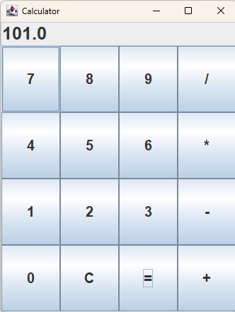

# 🧮 Calculator Application

Приложение калькулятора на Java Swing с базовыми математическими операциями.

## ✨ Особенности

• ➕ Сложение  
• ➖ Вычитание  
• ✖️ Умножение  
• ➗ Деление  
• 🧹 Очистка результата  

## 🚀 Быстрый запуск

1. Скачать проект  
2. Открыть в IntelliJ IDEA  
3. Запустить файл CalculatorApp.java  
4. Использовать приложение  

## 📷 Скриншоты

## 🛠 Технологии

• Java  
• Java Swing  
• AWT  

